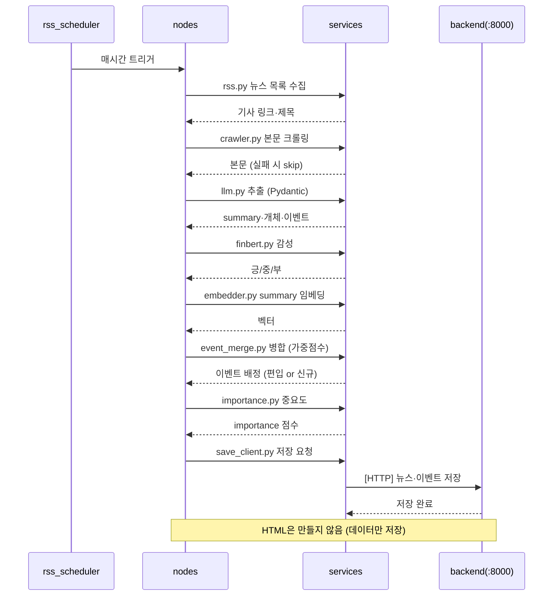
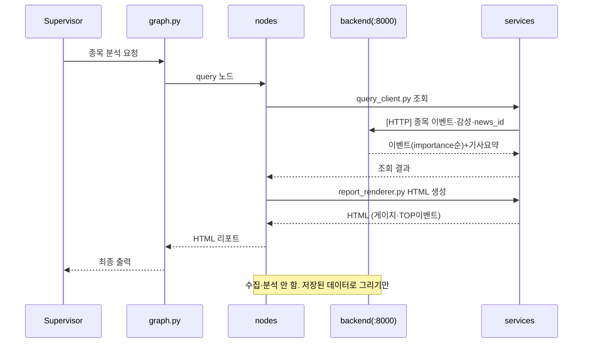
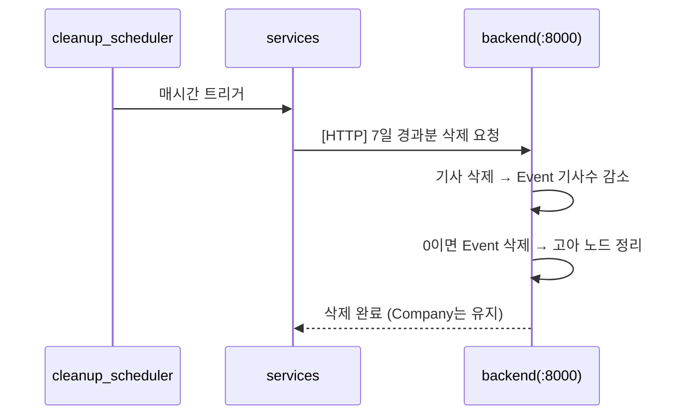

# 시퀀스 (news 에이전트)

> 배치 흐름과 리포트 흐름의 시간순 메시지 흐름.

## 1. 배치 흐름 (매시간)

```mermaid
sequenceDiagram
  participant SCH as rss_scheduler
  participant N as nodes
  participant SV as services
  participant BE as backend(:8000)
  SCH->>N: 매시간 트리거
  N->>SV: rss.py 뉴스 목록 수집
  SV-->>N: 기사 링크·제목
  N->>SV: crawler.py 본문 크롤링
  SV-->>N: 본문 (실패 시 skip)
  N->>SV: llm.py 추출 (Pydantic)
  SV-->>N: summary·개체·이벤트
  N->>SV: finbert.py 감성
  SV-->>N: 긍/중/부
  N->>SV: embedder.py summary 임베딩
  SV-->>N: 벡터
  N->>SV: event_merge.py 병합 (가중점수)
  SV-->>N: 이벤트 배정 (편입 or 신규)
  N->>SV: importance.py 중요도
  SV-->>N: importance 점수
  N->>SV: save_client.py 저장 요청
  SV->>BE: [HTTP] 뉴스·이벤트 저장
  BE-->>SV: 저장 완료
  Note over N,BE: HTML은 만들지 않음 (데이터만 저장)
```

## 2. 리포트 흐름 (사용자 요청)

```mermaid
sequenceDiagram
  participant U as Supervisor
  participant G as graph.py
  participant N as nodes
  participant BE as backend(:8000)
  participant SV as services
  U->>G: 종목 분석 요청
  G->>N: query 노드
  N->>SV: query_client.py 조회
  SV->>BE: [HTTP] 종목 이벤트·감성·news_id
  BE-->>SV: 이벤트(importance순)+기사요약
  SV-->>N: 조회 결과
  N->>SV: report_renderer.py HTML 생성
  SV-->>N: HTML (게이지·TOP이벤트)
  N-->>G: HTML 리포트
  G-->>U: 최종 출력
  Note over N,BE: 수집·분석 안 함. 저장된 데이터로 그리기만
```

## 3. 삭제 흐름 (매시간)

```mermaid
sequenceDiagram
  participant SCH as cleanup_scheduler
  participant SV as services
  participant BE as backend(:8000)
  SCH->>SV: 매시간 트리거
  SV->>BE: [HTTP] 7일 경과분 삭제 요청
  BE->>BE: 기사 삭제 → Event 기사수 감소
  BE->>BE: 0이면 Event 삭제 → 고아 노드 정리
  BE-->>SV: 삭제 완료 (Company는 유지)
```
