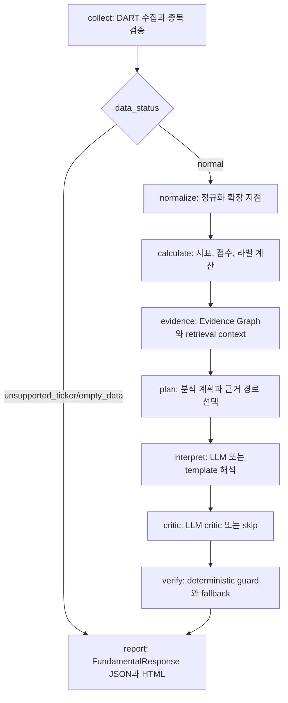

# 02. 아키텍처와 노드

`nodes/workflow.py`는 `StateGraph(FundamentalAgentState)`로 아래 순서를 구성합니다. `collect`에서 `data_status`가 `unsupported_ticker` 또는 `empty_data`이면 `report`로 바로 이동합니다.

## 노드별 역할

| 노드 파일 | 역할 | 주요 입력 상태키 | 주요 출력 상태키 | 실패 시 동작 |
| --- | --- | --- | --- | --- |
| `collect_node.py` | 종목코드 해석, DART 재무제표·주식수·정기공시 인사이트 수집 | `request`, `use_cache` | `corp_code`, `corp_name`, `years`, `fs_div`, `reprt_code`, `reprt_name`, `report_mode`, `period_basis`, `dart_calls`, `source_records`, `retrieval_summary`, `risk_flags`, `yearly_metrics`, `share_count`, `insights`, `data_status` | 미지원 종목은 `UNSUPPORTED_TICKER`, 빈 DART 데이터는 `DART_EMPTY_DATA`; CFS 실패 시 OFS fallback |
| `normalize_node.py` | 현재는 호환성 placeholder. 향후 GraphRAG/정규화 분리 지점 | 전체 state | 없음 | 상태 변경 없음 |
| `calc_node.py` | 지표, evidence, consistency, trend, score, label 계산 | `yearly_metrics`, `share_count`, `insights`, `reprt_code`, `risk_flags` | `ratios`, `evidence`, `risk_flags`, `consistency_notes`, `trend`, `score`, `score_breakdown`, `label` | 계산 불가 지표는 `MISSING_*` 또는 `NOT_MEANINGFUL_*` 플래그 |
| `evidence_node.py` | Evidence Graph, deterministic analyst plan, retrieval context 생성 | `ratios`, `trend`, `insights`, `evidence`, `risk_flags`, `score`, `label`, `request.intent`, `retrieval_summary` | `evidence_graph`, `analyst_plan`, `retrieval_context` | 별도 예외 처리 없음 |
| `plan_node.py` | LLM planner 또는 fallback plan으로 섹션 순서·근거 우선순위 결정 | `corp_name`, `request.intent`, `analyst_plan`, `evidence_graph`, `risk_flags` | `analysis_plan`, `analyst_plan`, `selected_paths`, `retrieval_context`, `agent_decisions`, `llm_call_count`, `planner_usage` | structured output 실패 시 `fallback_plan`; `agent_decisions`에 `fallback_plan` 기록 |
| `interpret_node.py` | Qwen/OpenAI/template 해석 호출 | `corp_name`, `score`, `label`, `ratios`, `trend`, `risk_flags`, `insights`, `analyst_plan`, `retrieval_context`, `period_basis` | `interpretation_result`, `verdict`, `interpretation`, `llm_verdict_label`, `llm_provider`, `llm_model`, `llm_latency_ms`, `llm_usage`, `llm_usage_records`, `llm_guard_violations`, `llm_call_count` | interpreter 내부 fallback으로 template까지 안전 착지 |
| `critic_node.py` | LLM critic이 초안을 accept/revise 판단 | `interpretation_result`, `llm_provider`, `llm_call_count`, `risk_flags`, `ratios`, `trend`, `selected_paths` | `critic_result`, `critic_usage`, `critic_revision_used`, 갱신된 해석 필드, `agent_decisions`, `failures` | template 해석이면 skip; critic structured output 실패 시 `critic_skipped` failure |
| `verify_node.py` | LLM 출력 숫자·표현 guard, verdict stability, 비용 요약 | `verdict`, `interpretation`, `ratios`, `evidence`, `score`, `trend`, `insights`, `label`, `llm_*`, `risk_flags` | `verification_summary`, `cost_summary`, `confidence`, `risk_flags`, `llm_guard_violations`, `agent_decisions`, `failures` | guard 실패 시 retry 가능하면 재생성, 최종 실패 시 template fallback |
| `report_node.py` | display field 부착, `erd_payload`, `report_html`, `FundamentalResponse` 조립 | 계산/해석/검증 결과 전체 | `meta`, `response` | `unsupported_ticker`/`empty_data`는 `_insufficient_response`로 최소 JSON 생성 |
| `workflow.py` | LangGraph 노드 등록과 조건부 edge 조립 | `FundamentalAgentState` | compiled workflow | collect 이후 데이터 상태로 report 직행 여부 결정 |

## 보조 모듈

| 파일 | 역할 |
| --- | --- |
| `core/decisions.py` | planner, evidence selector, critic, verify의 결정 이력을 `meta.agent_decisions`에 남기는 payload 생성 |
| `core/failures.py` | `unsupported_ticker`, `empty_data`, `critic_skipped`, `guard_rejected` 등 실패 payload 생성 |
| `core/run_history.py` | 민감정보 제외 whitelist로 `data/.runs/history.jsonl`에 실행 이력 저장, 최근 통계 계산 |
| `evidence/path_selector.py` | Evidence Graph에서 metric 우선순위 기반 account/filing 경로를 선택 |
| `interpret/planner.py` | 숫자 필드 없는 `AnalysisPlan` structured output 또는 fallback plan 생성 |
| `interpret/critic.py` | 숫자 필드 없는 `CriticOutput` structured output, revise prompt 생성 |
| `interpret/llm_client.py` | Qwen/OpenAI structured completion, pydantic 검증, 재시도, Qwen skip 상태 관리 |
| `interpret/llm_interpreter.py` | Qwen → OpenAI → template 순서의 해석 생성 |
| `ratios/calculators.py` | DART 계정 기반 재무 지표, evidence, missing/not meaningful 플래그 계산 |
| `ratios/scorer.py` | 100점 환산, 라벨, confidence 계산 |
| `verify/verdict_guard.py` | 투자 권유 표현, 미지원 지표, 허용되지 않은 숫자 검출 |
| `emit/html_builder.py` | self-contained `report_html` fragment 생성. JS와 외부 의존성 없이 표현 계층만 담당 |
