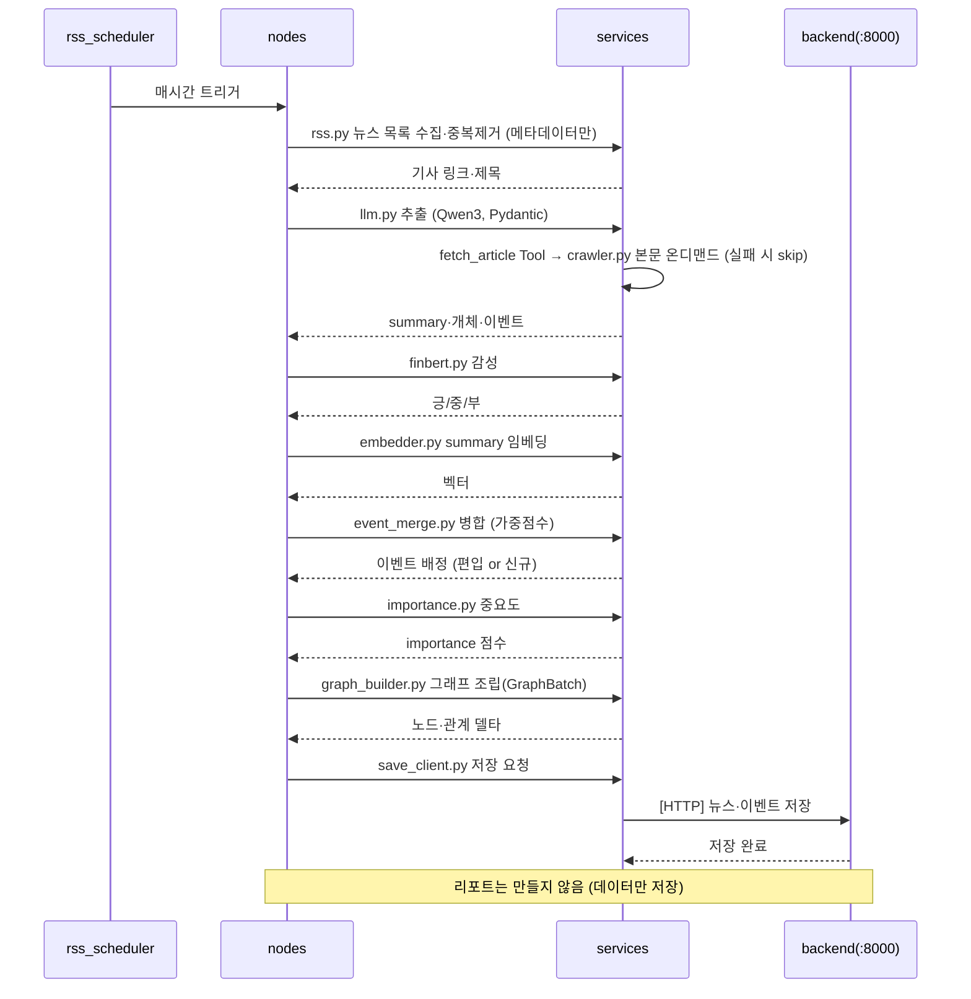
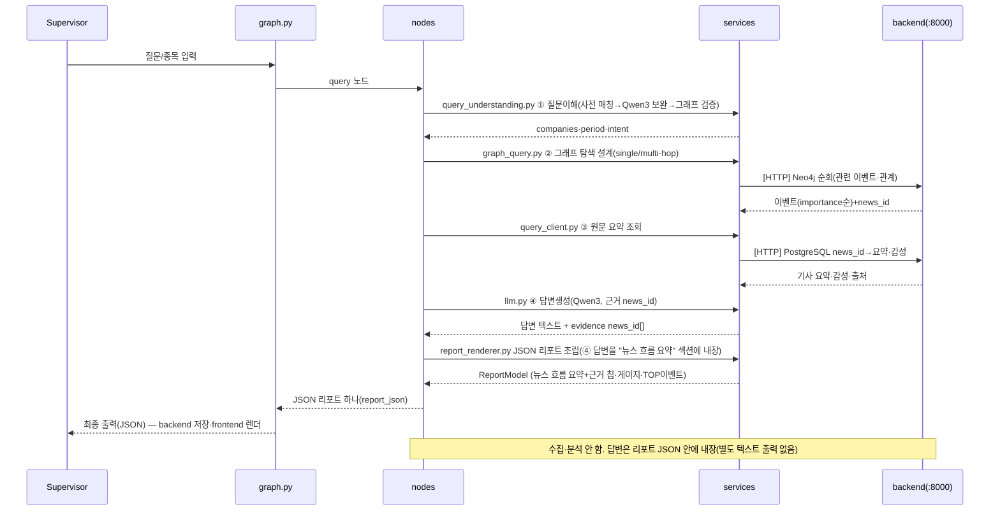
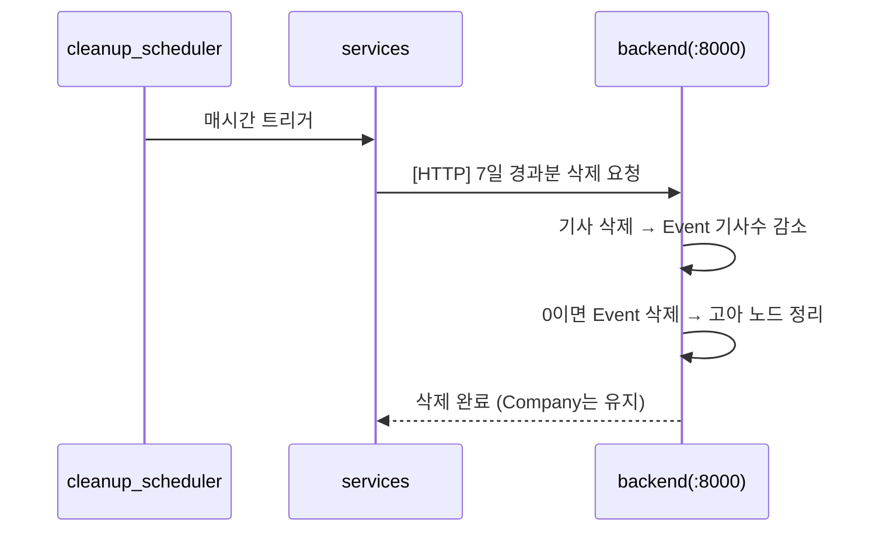

# 시퀀스 (news 에이전트)

> 배치 흐름과 리포트 흐름의 시간순 메시지 흐름.

## 1. 배치 흐름 (매시간)

```mermaid
sequenceDiagram
  participant SCH as rss_scheduler
  participant N as nodes
  participant SV as services
  participant BE as backend(:8000)
  SCH->>N: 매시간 트리거
  N->>SV: rss.py 뉴스 목록 수집·중복제거 (메타데이터만)
  SV-->>N: 기사 링크·제목
  N->>SV: llm.py 추출 (Qwen3, Pydantic)
  SV->>SV: fetch_article Tool → crawler.py 본문 온디맨드 (실패 시 skip)
  SV-->>N: summary·개체·이벤트
  N->>SV: finbert.py 감성
  SV-->>N: 긍/중/부
  N->>SV: embedder.py summary 임베딩
  SV-->>N: 벡터
  N->>SV: event_merge.py 병합 (가중점수)
  SV-->>N: 이벤트 배정 (편입 or 신규)
  N->>SV: importance.py 중요도
  SV-->>N: importance 점수
  N->>SV: graph_builder.py 그래프 조립(GraphBatch)
  SV-->>N: 노드·관계 델타
  N->>SV: save_client.py 저장 요청
  SV->>BE: [HTTP] 뉴스·이벤트 저장
  BE-->>SV: 저장 완료
  Note over N,BE: 리포트는 만들지 않음 (데이터만 저장)
```

## 2. 질의(리포트) 흐름 (사용자 요청) — 자유 질문형 B

```mermaid
sequenceDiagram
  participant U as Supervisor
  participant G as graph.py
  participant N as nodes
  participant SV as services
  participant BE as backend(:8000)
  U->>G: 질문/종목 입력
  G->>N: query 노드
  N->>SV: query_understanding.py ① 질문이해(사전 매칭→Qwen3 보완→그래프 검증)
  SV-->>N: companies·period·intent
  N->>SV: graph_query.py ② 그래프 탐색 설계(single/multi-hop)
  SV->>BE: [HTTP] Neo4j 순회(관련 이벤트·관계)
  BE-->>SV: 이벤트(importance순)+news_id
  N->>SV: query_client.py ③ 원문 요약 조회
  SV->>BE: [HTTP] PostgreSQL news_id→요약·감성
  BE-->>SV: 기사 요약·감성·출처
  N->>SV: llm.py ④ 답변생성(Qwen3, 근거 news_id)
  SV-->>N: 답변 텍스트 + evidence news_id[]
  N->>SV: report_renderer.py JSON 리포트 조립(④ 답변을 "뉴스 흐름 요약" 섹션에 내장)
  SV-->>N: ReportModel (뉴스 흐름 요약+근거 칩·게이지·TOP이벤트)
  N-->>G: JSON 리포트 하나(report_json)
  G-->>U: 최종 출력(JSON) — backend 저장·frontend 렌더
  Note over N,BE: 수집·분석 안 함. 답변은 리포트 JSON 안에 내장(별도 텍스트 출력 없음)
```

## 3. 삭제 흐름 (매시간)

```mermaid
sequenceDiagram
  participant SCH as cleanup_scheduler
  participant SV as services
  participant BE as backend(:8000)
  SCH->>SV: 매시간 트리거
  SV->>BE: [HTTP] 7일 경과분 삭제 요청
  BE->>BE: 기사 삭제 → Event 기사수 감소
  BE->>BE: 0이면 Event 삭제 → 고아 노드 정리
  BE-->>SV: 삭제 완료 (Company는 유지)
```
