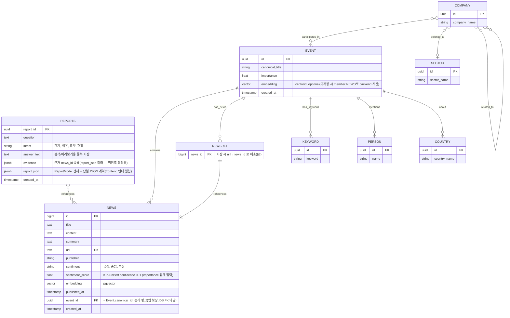

# news DB 모델 명세 (논리 설계 + backend 물리 대응)

> **물리 스키마 정본 = backend 통합 schema.** SQLAlchemy 모델(`backend/db/models/news/news.py`,
> `news_report.py`)과 Alembic 마이그레이션이 이미 존재하며, 물리 테이블명·제약의 정본이다.
> 이 문서는 컬럼 의미·논리 설계·Neo4j 경계를 설명한다. 원 논리 명세: `ai/src/agents/news/docs/erd.dbml`.
>
> **물리 대응(중요):**
> - 논리 `reports` → **물리 테이블 `news_reports`**
> - 논리 `reports.html` → **물리 `news_reports.report_json`(jsonb)** (렌더 HTML 대신 ReportModel 전체 JSON 보존)
> - `news_reports`에는 물리상 `owner_user_id`/`owner_session_id`(nullable, **FK 없음**)가 추가돼 있다.
> - `news.url`은 물리상 **NOT NULL + UNIQUE**(url 기반 upsert의 핵심), `news.title`도 **NOT NULL**.
> - `news.event_id`는 Neo4j `Event.canonical_id` **논리 링크(FK 없음)**.
> - **Neo4j 객체(Event/Company/Sector/NewsRef/Keyword/Person/Country)는 PostgreSQL 테이블이 아니다.**
>
> ⚠️ 논리 설계의 현행 기준은 아래 **§0 ERD**다(JSON 계약 반영). 원 논리 명세 `erd.dbml`이 옛 HTML 리포트·`BELONGS_TO` 필수 카디널리티를 아직 담고 있다면 §0에 맞춰 reconcile 필요.

## 경계 (중요)

- DB 모델 정의·마이그레이션·실제 접근은 **backend 소유**이며 여기서 관리한다.
- news 에이전트(ai, :9000)는 **DB에 직접 접근하지 않는다.** PostgreSQL·Neo4j 접근은
  전부 backend(:8000) HTTP API로만 이뤄진다(news 절대규칙 1). 이 폴더의 모델을
  news가 import 하지 않는다.
- ai↔backend API 계약(저장·조회·삭제 엔드포인트, 요청/응답 형태)의 **초안은 아래 §7**에 둔다.
  정식 문서 `verith/docs/api_contract.md`(현재 부재, 이 저장소 편집 범위 밖)로 **승격·확정**해야 한다.

---

## 0. ERD (전체 개요)

> **물리 저장소는 둘이다.** `NEWS`·`REPORTS`는 PostgreSQL 테이블, 나머지(`EVENT`·`COMPANY`·`SECTOR`·`NEWSREF`·`KEYWORD`·`PERSON`·`COUNTRY`)는 Neo4j 노드다. 아래 다이어그램의 관계선 중 **두 저장소를 걸치는 링크(`NEWS.event_id → EVENT`, `NEWSREF → NEWS`)는 DB FK 제약이 아니라 애플리케이션이 보장하는 논리 링크**다(실제 크로스-DB FK를 걸지 않는다).

**초안(옛 HTML 버전) 대비 변경점:**
1. `REPORTS.html` 제거 → **`report_json jsonb`**(ai가 돌려주는 `ReportModel` 통째). ai는 HTML을 만들지 않고 JSON 하나만 낸다(news CLAUDE.md §1, commit `1241fe7`). frontend가 이 JSON을 받아 렌더한다.
2. `NEWS.sentiment_score` 추가 — importance 통계(`EventArticleStats.sentiment_magnitude_sum`) 계산에 필수(§4, §7.2 stats).
3. `COMPANY ─ SECTOR` 카디널리티 `||`(필수 1) → **`o|`(0 또는 1)**. `BELONGS_TO`는 회사↔섹터 매핑 부재로 **기본 비활성**(ai `config.GRAPH_ENABLE_BELONGS_TO=False`, 3차·보류). `RELATED_TO`도 동일하게 기본 off(미래용).
4. `EVENT.embedding`(centroid) 명시 — 병합 후보 조회(`/news/events/recent`)가 `CandidateEvent.embedding`을 요구한다. backend가 저장하거나 member NEWS 임베딩으로 계산해 채운다(ai는 읽기만, §3).

---

## 1. PostgreSQL — `news` (기사 원본)

| 컬럼 | 타입 | 설명 |
|---|---|---|
| id | bigint PK (increment) | |
| title | text NOT NULL | |
| content | text | 본문 |
| summary | text | LLM(Qwen3) 통일 요약. 임베딩·병합 기준 |
| url | text NOT NULL UNIQUE | 원문 직링크. 1차 중복 차단(url upsert 키) |
| publisher | varchar | 언론사명. importance 가중치에 사용 |
| sentiment | varchar | KR-FinBert 결과: 긍정/중립/부정 |
| sentiment_score | real (float) nullable | KR-FinBert confidence(0~1, `Article.sentiment_score`). **importance 통계 집계 입력** — `EventArticleStats.sentiment_magnitude_sum` = 감성 있는 기사들의 이 값 합. 없으면(감성 미판정) NULL, 집계에서 제외 |
| embedding | vector (pgvector) | summary 임베딩(arctic-embed-l-v2.0-ko). Event centroid(§3) 계산 소스 |
| published_at | timestamp | 7일 롤링 기준 |
| event_id | uuid nullable | 소속 이벤트 = Event.canonical_id(UUID). ai `Article.event_id: str`와 정합. (news.id는 정수 PK로 별개) |
| created_at | timestamp | |

- **pgvector 확장 필요**(embedding). 유사 검색은 추후 ANN 인덱스.

## 2. PostgreSQL — `reports` (질의 결과 리포트) → 물리 테이블 `news_reports`

> 물리: 테이블명 `news_reports`, `html` 컬럼은 물리상 `report_json`(jsonb)로 저장, `owner_user_id`/`owner_session_id`(nullable, FK 없음) 추가.

| 컬럼 | 타입 | 설명 |
|---|---|---|
| report_id | uuid PK | uuid4(랜덤). Pydantic `Field(default_factory=lambda: str(uuid.uuid4()))` |
| question | text | 사용자 질문(또는 종목 프리셋) = `ReportModel.subject`/원 질문 |
| intent | varchar | 관계/이유/요약/현황 (검색·필터용 비정규화 컬럼) |
| answer_text | text | ④ 답변 본문 = `ReportModel.answer_text`. 검색·목록 미리보기용 중복 저장 |
| evidence | jsonb | 근거 news_id 목록 = `ReportModel.evidence_news_ids`. `report_json`의 미러 — `reports ↔ news` 역참조 질의("이 기사를 인용한 리포트")를 위한 비정규화 |
| report_json | jsonb | **ai가 돌려주는 `ReportModel` 전체(단일 JSON 계약).** frontend가 이 JSON을 받아 렌더한다 |
| created_at | timestamp | 시간순 정렬 기준(아이디엔 시간정보 안 넣음) |

- **출력은 JSON 하나(HTML 아님).** ai는 HTML을 만들지 않는다(news CLAUDE.md §1, commit `1241fe7 [refactor] news 리포트 출력을 HTML에서 단일 JSON 계약으로 전환`). ④ 답변은 별도 채널이 아니라 `report_json` 안 `answer_text`·`cited_event_ids`·`evidence_news_ids`로 내장된다. **frontend가 `report_json`을 받아 렌더**한다. `answer_text`·`intent`·`evidence`는 검색·역참조용 비정규화 사본일 뿐, 렌더 원본은 `report_json`이다.
- **리포트 저장 주체**: ai→backend "리포트 저장" 엔드포인트는 현재 저장 계약(§7.2)에 **없다.** ai `run_query()`는 `report_json`을 supervisor에 반환할 뿐이며(TASK 11), 이 테이블에 영속화할지·언제 할지는 supervisor/backend 결정이다. 영속화 시 위 컬럼은 그 `ReportModel` JSON에서 채운다.
- **컬럼 타입 UUID vs TEXT**: UUID 권장, TEXT도 무방 → backend와 합의 필요.

## 3. Neo4j — Event 중심 지식그래프

DBML은 RDB 표기라 관계형 그래프는 여기 목록으로 명세한다. News 원본은 넣지 않고
`news_id` 참조만 둔다.

- 중심 노드 **Event**: `id`(canonical), `canonical_title`, `importance`
  - 감성 count는 저장 안 함 → 조회 시 실시간 집계.
  - **centroid embedding(병합 후보용)**: `/news/events/recent`가 `CandidateEvent.embedding`(대표 벡터)을 돌려줘야 한다. backend가 Event 프로퍼티로 저장하거나, 소속 NEWS의 `embedding` 평균으로 계산해 채운다 — **ai는 읽기만 하고 centroid를 만들지 않는다**(ai TASK 05 §3.4). 저장 방식(Event 프로퍼티 vs 즉석 계산)은 backend 재량.
- 관계:
  - `(Company)-[:PARTICIPATES_IN]->(Event)`  여러 회사가 한 이벤트 공유 가능
  - `(Company)-[:BELONGS_TO]->(Sector)`  **기본 비활성**(ai `config.GRAPH_ENABLE_BELONGS_TO=False`). 회사↔섹터 매핑이 추출에 없어 3차·보류 → 섹터 없는 회사가 정상(카디널리티 0..1). 매핑 규칙 확정 시 활성화.
  - `(Company)-[:RELATED_TO]->(Company)`  같은 이벤트 공유 등에서 파생. **기본 비활성**(`config.GRAPH_ENABLE_RELATED_TO=False`, 3차·보류).
  - `(Event)-[:HAS_NEWS]->(NewsRef {news_id})`  본문은 PostgreSQL에서
  - `(Event)-[:HAS_KEYWORD]->(Keyword)`
  - `(Event)-[:MENTIONS]->(Person)`
  - `(Event)-[:ABOUT]->(Country)`
- **NewsRef 키 전환(★ backend 구현자 필독)**: ai가 보내는 `GraphBatch`의 NewsRef는 저장 전이라 news_id가 없어 **`key=url`** 로 온다(TASK 07 §0.2). backend는 저장 시 **`news.url` upsert로 얻은 `news.id`를 그 NewsRef의 `news_id`로 해소**한다. 즉 **입력 payload = url 키, 최종 Neo4j = `NewsRef {news_id}` 참조**. ai는 news_id를 만들지 않는다(같은 `save_batch` 요청 안에서 backend가 매핑).

## 4. importance (중요도)

`importance = 기사 개수 + 언론사 가중치 + 감성 절대값` — LLM 생성이 아닌 객관 계산.
언론사 가중치 테이블은 미정(튜닝 예정).

## 5. 삭제 규칙 (7일 롤링 CASCADE)

`published_at < now-168h` 기사 삭제 → Event 기사수 감소 → 0이면 Event 삭제 →
고아 Keyword/Person/Country 삭제 → **Company는 유지**.

- **삭제 후 importance 재계산(stale 방지)**: 기사 삭제로 **기사 집합이 바뀐(그러나 살아남은) Event**의 `importance`를 cleanup 트랜잭션 안에서 **현재 기사 집합 기준으로 재계산**한다. 재계산하지 않으면 새 기사가 더는 안 붙는 이벤트가 옛(부풀려진) 점수로 TOP 정렬을 계속 차지한다(예: 100건·importance 10 → 5건만 남아도 10 유지). 배치 흐름은 "새 기사가 편입된 이벤트"만 재계산하므로 이 갱신은 backend(cleanup)가 소유한다.
- **importance 공식은 ai와 공유하는 단일 정의**: 재계산 공식·가중치는 `ai/src/agents/news/tasks/06_importance.md §3.2`(및 §4)와 **동일**해야 한다(§4 참고). 공식이 두 곳에서 갈라지지 않도록 api_contract 승격 시 "importance 공식 소유·공유"를 확정 항목으로 둔다. `CleanupResponse`에 재계산된 이벤트 수를 선택적으로 포함할 수 있다.

## 6. 조회 요구 (질의 흐름 대응)

- 종목별 이벤트를 **importance순**으로 조회.
- 두 회사를 잇는 공유 이벤트(multi-hop) 순회.
- `news_id → 요약·감성·출처·published_at` 조회. **조회 응답의 각 기사 참조에는 `news_id`를 포함**(ai측 `ArticleRef`=news_id+summary+url). 근거(evidence) 추적 사슬의 원천이므로 생략하지 않는다.
- **대표 기사 조회와 근거 조회 분리**: 종목/공유 조회 응답의 각 `EventWithArticles`에는 **화면용 대표 소수(`articles`, news_id 포함)만** 담는다(이벤트별 전체 news_id를 DTO에 상시 싣지 않아 조회 DTO가 가볍다). ai의 ④ 답변생성은 이 대표 소수만으로 일반 리포트 근거를 닫고, 대표 소수를 넘는 깊은 근거가 필요할 때만 **on-demand로 `GET /news/events/{event_id}/articles?limit=N`**을 호출해 그 이벤트의 기사(`ArticleRef`)를 받는다(ai TASK 09 §3.5·§0.2, TASK 08 §3.5-3). Top-N 조정은 응답 스키마 변경 없이 `limit` 인자로. **bare news_id 목록이 아니라 `ArticleRef`(news_id+summary+url)를 돌려줘** id→기사 재조회 왕복을 없앤다.
- 이벤트별 감성 분포(긍/중/부)는 저장하지 않고 **실시간 집계**. 종목 조회 응답에는 이벤트별 `gauge`뿐 아니라 **전체 `overall_gauge`(None 제외 집계)를 backend가 채워** 반환한다(ai는 재집계 안 함, §7.3).

---

## 7. HTTP API 계약 (초안 — ai ↔ backend)

> ⚠️ **초안이자 in-scope 임시 계약.** 정식 문서 `verith/docs/api_contract.md`(부재, 편집 범위 밖)로 승격·확정 필요.
> 확정 전까지 ai는 `config.py`의 잠정 경로(TASK 08)로 이 계약을 소비한다. 요청/응답 본문은 ai `schemas/`(TASK 01) 모델과 1:1.

### 7.1 공통 규약
- **id 타입**: `news_id` = 정수(bigint, `Article.id`) · `event_id`/`canonical_id` = **UUID 문자열** · `report_id` = UUID.
- **쓰기(save/cleanup)**: 실패 시 정확 보고(`ok=false`, degrade 금지). **읽기(조회)**: backend 실패 시 ai가 degrade(TASK 08 §4.2).
- **멱등**: news는 `url` UNIQUE upsert, 그래프는 정체성 키 MERGE(TASK 07 §0.2). 재실행에도 중복 없음.
- **인증·접근 통제(잠정 결정)**: 1차 스코프는 **내부망 전용**을 전제로 한다 — ai(:9000)↔backend(:8000)가 외부에 노출되지 않는 폐쇄망/로컬에서만 통신한다고 가정한다. 특히 **쓰기·삭제 엔드포인트(`/news/batch/save`·`/news/cleanup`)는 무인증이면 네트워크에 닿는 누구나 데이터 저장·삭제를 유발**할 수 있으므로, 외부 노출 시에는 **내부 토큰(예: 공유 시크릿 헤더) 필수**로 승격한다. 인증 방식 확정(내부망 전제 유지 vs 토큰 도입)은 **api_contract 승격 시 확정 항목**(§7.3 참조). 확정 전까지 배포는 내부망 전제를 운영 제약으로 문서화한다.

### 7.2 엔드포인트 (잠정 경로 = TASK 08 config)
| 오퍼레이션 | 메서드·경로(잠정) | 요청 | 응답(ai schemas) |
|---|---|---|---|
| 배치 저장 | POST `/news/batch/save` | `{articles: Article[], graph_batch: GraphBatch}` | `SaveResponse` |
| 7일 삭제 | POST `/news/cleanup` | `{}` | `CleanupResponse` |
| 병합 후보 | GET `/news/events/recent` | `companies[]`, `within_days` | `CandidateEvent[]` |
| 중요도 통계 | GET `/news/events/stats` | `event_id` | `EventArticleStats \| null` |
| 종목 이벤트(single-hop) | GET `/news/query/subject` | `companies[]`, `within_days` | `SubjectQueryResponse`(이벤트별 대표 기사 소수 포함) |
| 공유 이벤트(multi-hop) | GET `/news/query/shared` | `company_a`, `company_b`, `within_days` | `SubjectQueryResponse` |
| 이벤트별 기사(근거) | GET `/news/events/{event_id}/articles` | `event_id`(path), `limit` | `ArticleRef[]`(news_id 포함) |

### 7.3 확정 결정 (리뷰 미해결 항목 → 여기서 닫음)
- **url→news_id 해소**: `save_batch` 한 요청 안에서 backend가 news를 `url` upsert로 저장→얻은 `news.id`를 같은 요청 GraphBatch의 NewsRef(`key=url`)에 매핑해 `NewsRef.news_id`로 해소(§3). ai는 news_id를 만들지 않는다.
- **Company 존재 검증(질의 ③)**: **별도 엔드포인트를 두지 않고** `/news/query/subject`의 `subject_found`로 대체한다. (후속에 `/news/company/exists`를 둘 수 있으나 **기본은 subject_found**.)
- **overall_gauge**: **backend가 `SubjectQueryResponse.overall_gauge`(전체 감성 집계, `sentiment=None` 제외)를 제공**한다. ai 렌더러는 비율만 계산하고 기사 감성을 재집계하지 않는다(절대규칙 4). 이벤트별 `gauge`도 backend 집계값.
- **이벤트별 근거 조회 경로**: 조회 DTO에 전체 news_id를 싣지 않고, 대표 소수(`EventWithArticles.articles`)를 넘는 근거는 **on-demand `GET /news/events/{event_id}/articles?limit=N`**(→ `ArticleRef[]`)로 제공한다(§6, §7.2). "대표 기사 조회"와 "근거 조회"를 분리해 이벤트 DTO를 경량 유지하고, Top-N은 `limit`으로 조정한다. 기사 정렬 기준(예: published_at desc)·`limit` 기본값·상한을 api_contract로 승격 시 확정.
