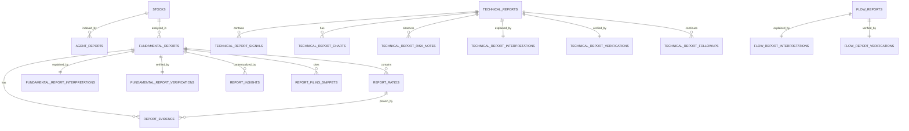

# veriθ Backend — 통합 PostgreSQL 스키마 (팀 공유 문서)

`docs/schema.md`

이 문서는 veriθ 백엔드의 **통합 ERD 기준 PostgreSQL 물리 스키마 정본**이다. 테이블·관계·타입·
제약·인덱스와 PostgreSQL/Neo4j 경계만 다룬다. 로컬 실행과 테스트는 [`../README.md`](../README.md),
스키마 변경 절차와 검증은 [`migrations.md`](migrations.md)를 따른다.

- 스키마 정의(정본): SQLAlchemy 모델 `backend/db/models/**` + Alembic 마이그레이션
- 최초 마이그레이션: `backend/db/migrations/versions/20260707_705a5833d4a3_add_integrated_postgresql_schema.py` (revision `705a5833d4a3`)
- DB 컬럼·테이블 변경은 이 문서를 먼저 갱신한다(코딩 가이드 §1.1).

---

## 1. PostgreSQL 확장 (extension)

최초 마이그레이션 `upgrade()` 가 테이블 생성 **전에** 아래를 만든다.

```sql
CREATE EXTENSION IF NOT EXISTS pgcrypto;   -- uuid PK 기본값 gen_random_uuid()
CREATE EXTENSION IF NOT EXISTS vector;     -- news.embedding 의 vector 타입
```

> **확장 관리 규칙:** `pgcrypto`/`vector` 는 **이 initial 마이그레이션에서만** 생성/삭제한다.
> **후속 마이그레이션에서는 extension 을 drop 하지 않는다** (공유 자원).

---

## 2. 타입 규칙

| 종류 | 규칙 |
|---|---|
| UUID PK | postgres `uuid`, 기본값 `gen_random_uuid()` |
| 종목코드/ticker/corp_code | **varchar (문자열)**. 숫자 타입 금지(앞자리 0 보존) |
| created_at / as_of | `timestamptz` (created_at 은 서버 기본값 `now()`) |
| base_date | `date` |
| JSON | `jsonb` |
| news.embedding | `vector` (pgvector, **차원 미지정** — §5 참고) |

---

## 3. 테이블 카탈로그 (22개, 도메인별)

### Common
| 테이블 | 요약 | PK |
|---|---|---|
| `stocks` | 종목 마스터(코드·이름·시장) | `stock_code` (varchar) |
| `agent_reports` | 전 에이전트 리포트 통합 인덱스 | `id` (uuid) |

### Fundamental (재무)
| 테이블 | 요약 |
|---|---|
| `fundamental_reports` | 재무 분석 리포트 root |
| `report_ratios` | 재무 비율(roe·부채비율 등) |
| `report_evidence` | 비율/주장의 DART 원천 근거 |
| `fundamental_report_interpretations` | LLM/규칙 해석 (1:1) |
| `fundamental_report_verifications` | 검증 결과 (1:1) |
| `report_insights` | 배당/주주/감사 등 맥락 인사이트 |
| `report_filing_snippets` | 공시 원문 스니펫 |

### Technical (기술적)
| 테이블 | 요약 |
|---|---|
| `technical_reports` | 기술적 분석 리포트 root |
| `technical_report_signals` | 지표 신호 |
| `technical_report_charts` | 차트 페이로드 |
| `technical_report_risk_notes` | 리스크 노트 |
| `technical_report_interpretations` | 해석 (1:1) |
| `technical_report_verifications` | 검증 (1:1) |
| `technical_report_followups` | 후속 질의 |

### News (뉴스, PostgreSQL 부분만)
| 테이블 | 요약 |
|---|---|
| `news` | 기사 원본. `embedding vector`, `event_id`(Neo4j 논리 링크) |
| `news_reports` | 뉴스 질의 결과 리포트 (`report_id` PK) |

### Flow (수급)
| 테이블 | 요약 |
|---|---|
| `flow_reports` | 수급/자금흐름 리포트 root |
| `flow_report_interpretations` | 해석 (1:1) |
| `flow_report_verifications` | 검증 (1:1) |

### Industry (산업/섹터)
| 테이블 | 요약 |
|---|---|
| `industry_reports` | 산업 에이전트 PostgreSQL 리포트 저장 테이블. `payload`=research-report.v1 전체 JSON 정본 |

> **명칭 확정:** 5번째 에이전트는 **industry(산업/섹터)**. 과거 `macro` 명칭은 폐기, 테이블은 `industry_reports`.
>
> **industry_reports 규약:**
> - `payload`(jsonb)는 산업 에이전트 **research-report.v1 전체 JSON 정본**이다.
> - `report_id`(text, UNIQUE)는 `payload.reportId` 와 매핑되는 **외부 노출 ID**. 내부 PK 는 `id`(uuid)다.
> - `status`(pending/processing/completed/failed)가 리포트 lifecycle 정본. `data_status`·`input_payload`·`output_payload` 는 통합 호환용(reserved).
> - `agent_reports.agent_report_id` 는 `industry_reports.id`(report_id 아님)를 가리키는 **app-level reference**(FK 없음).
> - **Neo4j 의 Company/Industry/Product/Policy/Person/Chunk 는 PostgreSQL 테이블로 만들지 않는다**(그래프는 app 레벨 별도 처리).
> - 인덱스: `report_id` UNIQUE, `created_at DESC`, `question_type`, `payload` **GIN**, `request_id`, `trace_id`.

---

## 4. 관계와 무결성 (PostgreSQL 한정)

Neo4j 그래프(EVENT/COMPANY/SECTOR/…)는 **PostgreSQL 테이블이 아니다**(§6). 아래는 PG FK만.



FK 전체 목록 (17개):

```
agent_reports.stock_code                        -> stocks.stock_code
fundamental_reports.stock_code                  -> stocks.stock_code
report_ratios.report_id                         -> fundamental_reports.id
report_evidence.report_id                       -> fundamental_reports.id
report_evidence.ratio_id (nullable)             -> report_ratios.id
report_insights.report_id                       -> fundamental_reports.id
report_filing_snippets.report_id                -> fundamental_reports.id
fundamental_report_interpretations.report_id(UQ)-> fundamental_reports.id
fundamental_report_verifications.report_id(UQ)  -> fundamental_reports.id
technical_report_signals.report_id              -> technical_reports.id
technical_report_charts.report_id               -> technical_reports.id
technical_report_risk_notes.report_id           -> technical_reports.id
technical_report_followups.report_id            -> technical_reports.id
technical_report_interpretations.report_id(UQ)  -> technical_reports.id
technical_report_verifications.report_id(UQ)    -> technical_reports.id
flow_report_interpretations.report_id(UQ)       -> flow_reports.id
flow_report_verifications.report_id(UQ)         -> flow_reports.id
```

**ON DELETE CASCADE** (자식 15개 FK): fundamental 7 + technical 6 + flow 2. report 삭제 시 자식이 함께 삭제된다. **`stocks` 참조 2개(agent_reports·fundamental_reports)는 마스터라 CASCADE 아님(NO ACTION).**

**FK 를 걸지 않는 것** (앱 레벨 논리 링크):
`agent_reports.agent_report_id`, `news.event_id`(Neo4j Event.canonical_id),
`news_reports.evidence`, 모든 `owner_user_id` / `owner_session_id`.

UNIQUE (9): `technical_reports.request_id`, `news.url`, **`technical_report_signals(report_id, indicator)`**, 그리고 1:1 report_id 6개(fundamental·technical·flow interpretations/verifications).

**NOT NULL 정책(핵심):** 항상 존재하는 실행 메타데이터와 degraded에도 sentinel로 채워지는 컬럼만 NOT NULL. 예) `technical_reports`: `request_id`·`ticker`·`data_status`·`source`·`trace_id`·`as_of`·`input_payload`·`output_payload`·`final_regime`·`daily_regime`·`alignment_flag` = NOT NULL / `consensus`·`signal_score`·`confidence`·`weekly_trend`·`monthly_trend` = nullable. `news`: `title`·`url` NOT NULL. 통합 ERD 신규 컬럼(`timeframe`, `chart_*`)은 저장 정책 확정 전까지 nullable.

명시 인덱스 (`ix_` 18개 + signals UNIQUE 제약 1, DESC 는 표현식 인덱스):
```
agent_reports        (agent_type, created_at DESC) / (client_session_id, created_at DESC)
                     / (stock_code, created_at DESC) / (trace_id)
fundamental_reports  (request_id) / (stock_code, as_of DESC) / (trace_id)
technical_reports    (client_session_id, created_at DESC) / (ticker, as_of DESC) / (trace_id)
technical_report_charts     (report_id, period)
technical_report_signals    UNIQUE(report_id, indicator)
technical_report_risk_notes (report_id, severity)
technical_report_followups  (report_id, created_at)
news                 (event_id) / (published_at)
news_reports         (created_at DESC)
flow_reports         (ticker, base_date DESC) / (trace_id)
```

---

## 5. news.embedding 차원(dimension) 미정

- 임베딩 모델은 `arctic-embed-l-v2.0-ko`(news `SCHEMA_SPEC.md`)지만 **차원 숫자가 코드/문서에
  확정돼 있지 않아**, 컬럼은 **차원 없는 `vector`** 로 생성했다.
- 유사도 검색용 **ANN 인덱스(ivfflat/hnsw)** 는 차원 확정 후 **별도 마이그레이션**에서 추가한다.
  (dimensionless vector 에는 ANN 인덱스를 만들 수 없다.)

---

## 6. Neo4j 경계 — PostgreSQL 에 만들지 않는 것

아래는 뉴스 에이전트의 **Neo4j logical graph** 이며 **PostgreSQL 테이블로 만들지 않는다.**

```
EVENT, COMPANY, SECTOR, NEWSREF, KEYWORD, PERSON, COUNTRY
```

PostgreSQL 에는 `news.event_id`(nullable uuid)만 둬서 Neo4j `Event.canonical_id` 를 **논리적으로**
가리킨다. DB FK 는 없다. Event↔News 연결은 backend app 레벨에서 처리한다.

---

## 7. 마이그레이션 불변 규칙

- 모델 추가 시 `backend/db/models/registry.py`에 등록한다.
- 테이블·컬럼·제약 변경은 Alembic revision으로 반영한다.
- `pgcrypto`와 `vector`는 initial migration에서만 생성·삭제하고 후속 migration에서 drop하지 않는다.
- 이미 공유·적용된 migration은 수정하지 않고 새 revision에서 보강한다.
- 상세 생성·검증·트러블슈팅 절차는 [`migrations.md`](migrations.md)를 따른다.

---

## 8. 저장 계층 주의사항

- **`agent_reports.stock_code` / `fundamental_reports.stock_code` → `stocks.stock_code` FK**:
  리포트를 저장하기 전에 해당 종목이 `stocks` 에 있어야 한다.
  기본 지원 종목은 [`../README.md`](../README.md)의 seed 절차로 구성한다. 런타임 저장에서도
  결측에 대비해 `stocks`를 먼저 확보한 뒤 리포트/index를 저장한다.
- `stock_code` 는 **nullable** 이다(뉴스/산업/거시성 질의는 종목이 없을 수 있음).
